# Reverse tasks set-2

## cmubomb

### phase_1

`disas phase_1` gives :

```assembly
   0x08048b20 <+0>:	push   ebp
   0x08048b21 <+1>:	mov    ebp,esp
   0x08048b23 <+3>:	sub    esp,0x8
   0x08048b26 <+6>:	mov    eax,DWORD PTR [ebp+0x8]
   0x08048b29 <+9>:	add    esp,0xfffffff8
   0x08048b2c <+12>:	push   0x80497c0
   0x08048b31 <+17>:	push   eax
   0x08048b32 <+18>:	call   0x8049030 <strings_not_equal>
   0x08048b37 <+23>:	add    esp,0x10
   0x08048b3a <+26>:	test   eax,eax
   0x08048b3c <+28>:	je     0x8048b43 <phase_1+35>
   0x08048b3e <+30>:	call   0x80494fc <explode_bomb>
   0x08048b43 <+35>:	mov    esp,ebp
   0x08048b45 <+37>:	pop    ebp
   0x08048b46 <+38>:	ret
```


Our input is compared with a string and the phase is diffused if they are equal. We can get that string by setting up a break-point before the comparison and give that string as input.

input : **Public speaking is very easy.**

### phase_2

`disas phase_2` gives :

```assembly
   0x08048b48 <+0>:	push   ebp
   0x08048b49 <+1>:	mov    ebp,esp
   0x08048b4b <+3>:	sub    esp,0x20
   0x08048b4e <+6>:	push   esi
   0x08048b4f <+7>:	push   ebx
   0x08048b50 <+8>:	mov    edx,DWORD PTR [ebp+0x8]
   0x08048b53 <+11>:	add    esp,0xfffffff8
   0x08048b56 <+14>:	lea    eax,[ebp-0x18]
   0x08048b59 <+17>:	push   eax
   0x08048b5a <+18>:	push   edx
   0x08048b5b <+19>:	call   0x8048fd8 <read_six_numbers>
   0x08048b60 <+24>:	add    esp,0x10
   0x08048b63 <+27>:	cmp    DWORD PTR [ebp-0x18],0x1
   0x08048b67 <+31>:	je     0x8048b6e <phase_2+38>
   0x08048b69 <+33>:	call   0x80494fc <explode_bomb>
   0x08048b6e <+38>:	mov    ebx,0x1
   0x08048b73 <+43>:	lea    esi,[ebp-0x18]
   0x08048b76 <+46>:	lea    eax,[ebx+0x1]
   0x08048b79 <+49>:	imul   eax,DWORD PTR [esi+ebx*4-0x4]
   0x08048b7e <+54>:	cmp    DWORD PTR [esi+ebx*4],eax
   0x08048b81 <+57>:	je     0x8048b88 <phase_2+64>
   0x08048b83 <+59>:	call   0x80494fc <explode_bomb>
   0x08048b88 <+64>:	inc    ebx
   0x08048b89 <+65>:	cmp    ebx,0x5
   0x08048b8c <+68>:	jle    0x8048b76 <phase_2+46>
   0x08048b8e <+70>:	lea    esp,[ebp-0x28]
   0x08048b91 <+73>:	pop    ebx
   0x08048b92 <+74>:	pop    esi
   0x08048b93 <+75>:	mov    esp,ebp
   0x08048b95 <+77>:	pop    ebp
   0x08048b96 <+78>:	ret
```

Here we have to input 6 space separated numbers. Then some operations are did on them. First number is compared with 1. so first number is 1 and the next numbers are their position multiplied by their previous number.

input : **1 2 6 24 120 720**

### phase_3

`disas phase_3` gives :

```assembly
   0x08048b98 <+0>:	push   ebp
   0x08048b99 <+1>:	mov    ebp,esp
   0x08048b9b <+3>:	sub    esp,0x14
   0x08048b9e <+6>:	push   ebx
   0x08048b9f <+7>:	mov    edx,DWORD PTR [ebp+0x8]
   0x08048ba2 <+10>:	add    esp,0xfffffff4
   0x08048ba5 <+13>:	lea    eax,[ebp-0x4]
   0x08048ba8 <+16>:	push   eax
   0x08048ba9 <+17>:	lea    eax,[ebp-0x5]
   0x08048bac <+20>:	push   eax
   0x08048bad <+21>:	lea    eax,[ebp-0xc]
   0x08048bb0 <+24>:	push   eax
   0x08048bb1 <+25>:	push   0x80497de
   0x08048bb6 <+30>:	push   edx
   0x08048bb7 <+31>:	call   0x8048860 <sscanf@plt>
   0x08048bbc <+36>:	add    esp,0x20
   0x08048bbf <+39>:	cmp    eax,0x2
   0x08048bc2 <+42>:	jg     0x8048bc9 <phase_3+49>
   0x08048bc4 <+44>:	call   0x80494fc <explode_bomb>
   0x08048bc9 <+49>:	cmp    DWORD PTR [ebp-0xc],0x7
   0x08048bcd <+53>:	ja     0x8048c88 <phase_3+240>
   0x08048bd3 <+59>:	mov    eax,DWORD PTR [ebp-0xc]
   0x08048bd6 <+62>:	jmp    DWORD PTR [eax*4+0x80497e8]
   0x08048bdd <+69>:	lea    esi,[esi+0x0]
   0x08048be0 <+72>:	mov    bl,0x71
   0x08048be2 <+74>:	cmp    DWORD PTR [ebp-0x4],0x309
   0x08048be9 <+81>:	je     0x8048c8f <phase_3+247>
   0x08048bef <+87>:	call   0x80494fc <explode_bomb>
   0x08048bf4 <+92>:	jmp    0x8048c8f <phase_3+247>
   0x08048bf9 <+97>:	lea    esi,[esi+eiz*1+0x0]
   0x08048c00 <+104>:	mov    bl,0x62
   0x08048c02 <+106>:	cmp    DWORD PTR [ebp-0x4],0xd6
   0x08048c09 <+113>:	je     0x8048c8f <phase_3+247>
   0x08048c0f <+119>:	call   0x80494fc <explode_bomb>
   0x08048c14 <+124>:	jmp    0x8048c8f <phase_3+247>
   0x08048c16 <+126>:	mov    bl,0x62
   0x08048c18 <+128>:	cmp    DWORD PTR [ebp-0x4],0x2f3
   0x08048c1f <+135>:	je     0x8048c8f <phase_3+247>
   0x08048c21 <+137>:	call   0x80494fc <explode_bomb>
   0x08048c26 <+142>:	jmp    0x8048c8f <phase_3+247>
   0x08048c28 <+144>:	mov    bl,0x6b
   0x08048c2a <+146>:	cmp    DWORD PTR [ebp-0x4],0xfb
   0x08048c31 <+153>:	je     0x8048c8f <phase_3+247>
   0x08048c33 <+155>:	call   0x80494fc <explode_bomb>
   0x08048c38 <+160>:	jmp    0x8048c8f <phase_3+247>
   0x08048c3a <+162>:	lea    esi,[esi+0x0]
   0x08048c40 <+168>:	mov    bl,0x6f
   0x08048c42 <+170>:	cmp    DWORD PTR [ebp-0x4],0xa0
   0x08048c49 <+177>:	je     0x8048c8f <phase_3+247>
   0x08048c4b <+179>:	call   0x80494fc <explode_bomb>
   0x08048c50 <+184>:	jmp    0x8048c8f <phase_3+247>
   0x08048c52 <+186>:	mov    bl,0x74
   0x08048c54 <+188>:	cmp    DWORD PTR [ebp-0x4],0x1ca
   0x08048c5b <+195>:	je     0x8048c8f <phase_3+247>
   0x08048c5d <+197>:	call   0x80494fc <explode_bomb>
   0x08048c62 <+202>:	jmp    0x8048c8f <phase_3+247>
   0x08048c64 <+204>:	mov    bl,0x76
   0x08048c66 <+206>:	cmp    DWORD PTR [ebp-0x4],0x30c
   0x08048c6d <+213>:	je     0x8048c8f <phase_3+247>
   0x08048c6f <+215>:	call   0x80494fc <explode_bomb>
   0x08048c74 <+220>:	jmp    0x8048c8f <phase_3+247>
   0x08048c76 <+222>:	mov    bl,0x62
   0x08048c78 <+224>:	cmp    DWORD PTR [ebp-0x4],0x20c
   0x08048c7f <+231>:	je     0x8048c8f <phase_3+247>
   0x08048c81 <+233>:	call   0x80494fc <explode_bomb>
   0x08048c86 <+238>:	jmp    0x8048c8f <phase_3+247>
   0x08048c88 <+240>:	mov    bl,0x78
   0x08048c8a <+242>:	call   0x80494fc <explode_bomb>
   0x08048c8f <+247>:	cmp    bl,BYTE PTR [ebp-0x5]
   0x08048c92 <+250>:	je     0x8048c99 <phase_3+257>
   0x08048c94 <+252>:	call   0x80494fc <explode_bomb>
   0x08048c99 <+257>:	mov    ebx,DWORD PTR [ebp-0x18]
   0x08048c9c <+260>:	mov    esp,ebp
   0x08048c9e <+262>:	pop    ebp
   0x08048c9f <+263>:	ret 
```

Here we have to input a number a character and another number. The number is our choice in the switch case and the character and the next number should be the ones specified in our choice. We have 8 choices any one of them should work

input : **2 b 755**

### phase_4

`disas phase_4` gives us :

```assembly
0x08048ce0 <+0>:	push   ebp
   0x08048ce1 <+1>:	mov    ebp,esp
   0x08048ce3 <+3>:	sub    esp,0x18
   0x08048ce6 <+6>:	mov    edx,DWORD PTR [ebp+0x8]
   0x08048ce9 <+9>:	add    esp,0xfffffffc
   0x08048cec <+12>:	lea    eax,[ebp-0x4]
   0x08048cef <+15>:	push   eax
   0x08048cf0 <+16>:	push   0x8049808
   0x08048cf5 <+21>:	push   edx
   0x08048cf6 <+22>:	call   0x8048860 <sscanf@plt>
   0x08048cfb <+27>:	add    esp,0x10
   0x08048cfe <+30>:	cmp    eax,0x1
   0x08048d01 <+33>:	jne    0x8048d09 <phase_4+41>
   0x08048d03 <+35>:	cmp    DWORD PTR [ebp-0x4],0x0
   0x08048d07 <+39>:	jg     0x8048d0e <phase_4+46>
   0x08048d09 <+41>:	call   0x80494fc <explode_bomb>
   0x08048d0e <+46>:	add    esp,0xfffffff4
   0x08048d11 <+49>:	mov    eax,DWORD PTR [ebp-0x4]
   0x08048d14 <+52>:	push   eax
   0x08048d15 <+53>:	call   0x8048ca0 <func4>
   0x08048d1a <+58>:	add    esp,0x10
   0x08048d1d <+61>:	cmp    eax,0x37
   0x08048d20 <+64>:	je     0x8048d27 <phase_4+71>
   0x08048d22 <+66>:	call   0x80494fc <explode_bomb>
   0x08048d27 <+71>:	mov    esp,ebp
   0x08048d29 <+73>:	pop    ebp
   0x08048d2a <+74>:	ret
```

Here it calls another function `func4`. `disas func4` gives us :

```assembly
0x08048ca0 <+0>:	push   ebp
   0x08048ca1 <+1>:	mov    ebp,esp
   0x08048ca3 <+3>:	sub    esp,0x10
   0x08048ca6 <+6>:	push   esi
   0x08048ca7 <+7>:	push   ebx
   0x08048ca8 <+8>:	mov    ebx,DWORD PTR [ebp+0x8]
   0x08048cab <+11>:	cmp    ebx,0x1
   0x08048cae <+14>:	jle    0x8048cd0 <func4+48>
   0x08048cb0 <+16>:	add    esp,0xfffffff4
   0x08048cb3 <+19>:	lea    eax,[ebx-0x1]
   0x08048cb6 <+22>:	push   eax
   0x08048cb7 <+23>:	call   0x8048ca0 <func4>
   0x08048cbc <+28>:	mov    esi,eax
   0x08048cbe <+30>:	add    esp,0xfffffff4
   0x08048cc1 <+33>:	lea    eax,[ebx-0x2]
   0x08048cc4 <+36>:	push   eax
   0x08048cc5 <+37>:	call   0x8048ca0 <func4>
   0x08048cca <+42>:	add    eax,esi
   0x08048ccc <+44>:	jmp    0x8048cd5 <func4+53>
   0x08048cce <+46>:	mov    esi,esi
   0x08048cd0 <+48>:	mov    eax,0x1
   0x08048cd5 <+53>:	lea    esp,[ebp-0x18]
   0x08048cd8 <+56>:	pop    ebx
   0x08048cd9 <+57>:	pop    esi
   0x08048cda <+58>:	mov    esp,ebp
   0x08048cdc <+60>:	pop    ebp
   0x08048cdd <+61>:	ret
```

Here it calls the same function inside it two times. when it exits the function eax should be 0x37

Complex!!! Since it is checked with 55 we just brute-force it with all numbers and 9 gives us 

**"So you got that one.  Try this one."**

We give **austinpowers** too in the input to unlock the secret_phase

input : **9 austinpowers**

### phase_5

`disas phase_5` gives us :

```assembly
   0x08048d2c <+0>:	push   ebp
   0x08048d2d <+1>:	mov    ebp,esp
   0x08048d2f <+3>:	sub    esp,0x10
   0x08048d32 <+6>:	push   esi
   0x08048d33 <+7>:	push   ebx
   0x08048d34 <+8>:	mov    ebx,DWORD PTR [ebp+0x8]
   0x08048d37 <+11>:	add    esp,0xfffffff4
   0x08048d3a <+14>:	push   ebx
   0x08048d3b <+15>:	call   0x8049018 <string_length>
   0x08048d40 <+20>:	add    esp,0x10
   0x08048d43 <+23>:	cmp    eax,0x6
   0x08048d46 <+26>:	je     0x8048d4d <phase_5+33>
   0x08048d48 <+28>:	call   0x80494fc <explode_bomb>
   0x08048d4d <+33>:	xor    edx,edx
   0x08048d4f <+35>:	lea    ecx,[ebp-0x8]
   0x08048d52 <+38>:	mov    esi,0x804b220
   0x08048d57 <+43>:	mov    al,BYTE PTR [edx+ebx*1]
   0x08048d5a <+46>:	and    al,0xf
   0x08048d5c <+48>:	movsx  eax,al
   0x08048d5f <+51>:	mov    al,BYTE PTR [eax+esi*1]
   0x08048d62 <+54>:	mov    BYTE PTR [edx+ecx*1],al
   0x08048d65 <+57>:	inc    edx
   0x08048d66 <+58>:	cmp    edx,0x5
   0x08048d69 <+61>:	jle    0x8048d57 <phase_5+43>
   0x08048d6b <+63>:	mov    BYTE PTR [ebp-0x2],0x0
   0x08048d6f <+67>:	add    esp,0xfffffff8
   0x08048d72 <+70>:	push   0x804980b
   0x08048d77 <+75>:	lea    eax,[ebp-0x8]
   0x08048d7a <+78>:	push   eax
   0x08048d7b <+79>:	call   0x8049030 <strings_not_equal>
   0x08048d80 <+84>:	add    esp,0x10
   0x08048d83 <+87>:	test   eax,eax
   0x08048d85 <+89>:	je     0x8048d8c <phase_5+96>
   0x08048d87 <+91>:	call   0x80494fc <explode_bomb>
   0x08048d8c <+96>:	lea    esp,[ebp-0x18]
   0x08048d8f <+99>:	pop    ebx
   0x08048d90 <+100>:	pop    esi
   0x08048d91 <+101>:	mov    esp,ebp
   0x08048d93 <+103>:	pop    ebp
   0x08048d94 <+104>:	ret
```

It checks the string length with 6. and then it does AND operation on our characters with 0xF and takes the corresponding character from the string **isrveawhobpnutfg\260\001**

and then checks the final string with "giants"

so we need the result of the AND operations 15,0,5,11,13,1

AND operation of characters with 0xF is as follows:

```
a 1
b 2
c 3
d 4
e 5
f 6
g 7
h 8
i 9
j 10
k 11
l 12
m 13
n 14
o 15
p 0
```

input : **opekma**

### phase_6

`disas phase_6` gives us :

```assembly
   0x08048d98 <+0>:	push   ebp
   0x08048d99 <+1>:	mov    ebp,esp
   0x08048d9b <+3>:	sub    esp,0x4c
   0x08048d9e <+6>:	push   edi
   0x08048d9f <+7>:	push   esi
   0x08048da0 <+8>:	push   ebx
   0x08048da1 <+9>:	mov    edx,DWORD PTR [ebp+0x8]
   0x08048da4 <+12>:	mov    DWORD PTR [ebp-0x34],0x804b26c
   0x08048dab <+19>:	add    esp,0xfffffff8
   0x08048dae <+22>:	lea    eax,[ebp-0x18]
   0x08048db1 <+25>:	push   eax
   0x08048db2 <+26>:	push   edx
   0x08048db3 <+27>:	call   0x8048fd8 <read_six_numbers>
   0x08048db8 <+32>:	xor    edi,edi
   0x08048dba <+34>:	add    esp,0x10
   0x08048dbd <+37>:	lea    esi,[esi+0x0]
   0x08048dc0 <+40>:	lea    eax,[ebp-0x18]
   0x08048dc3 <+43>:	mov    eax,DWORD PTR [eax+edi*4]
   0x08048dc6 <+46>:	dec    eax
   0x08048dc7 <+47>:	cmp    eax,0x5
   0x08048dca <+50>:	jbe    0x8048dd1 <phase_6+57>
   0x08048dcc <+52>:	call   0x80494fc <explode_bomb>
   0x08048dd1 <+57>:	lea    ebx,[edi+0x1]
   0x08048dd4 <+60>:	cmp    ebx,0x5
   0x08048dd7 <+63>:	jg     0x8048dfc <phase_6+100>
   0x08048dd9 <+65>:	lea    eax,[edi*4+0x0]
   0x08048de0 <+72>:	mov    DWORD PTR [ebp-0x38],eax
   0x08048de3 <+75>:	lea    esi,[ebp-0x18]
   0x08048de6 <+78>:	mov    edx,DWORD PTR [ebp-0x38]
   0x08048de9 <+81>:	mov    eax,DWORD PTR [edx+esi*1]
   0x08048dec <+84>:	cmp    eax,DWORD PTR [esi+ebx*4]
   0x08048def <+87>:	jne    0x8048df6 <phase_6+94>
   0x08048df1 <+89>:	call   0x80494fc <explode_bomb>
   0x08048df6 <+94>:	inc    ebx
   0x08048df7 <+95>:	cmp    ebx,0x5
   0x08048dfa <+98>:	jle    0x8048de6 <phase_6+78>
   0x08048dfc <+100>:	inc    edi
   0x08048dfd <+101>:	cmp    edi,0x5
   0x08048e00 <+104>:	jle    0x8048dc0 <phase_6+40>
   0x08048e02 <+106>:	xor    edi,edi
   0x08048e04 <+108>:	lea    ecx,[ebp-0x18]
   0x08048e07 <+111>:	lea    eax,[ebp-0x30]
   0x08048e0a <+114>:	mov    DWORD PTR [ebp-0x3c],eax
   0x08048e0d <+117>:	lea    esi,[esi+0x0]
   0x08048e10 <+120>:	mov    esi,DWORD PTR [ebp-0x34]
   0x08048e13 <+123>:	mov    ebx,0x1
   0x08048e18 <+128>:	lea    eax,[edi*4+0x0]
   0x08048e1f <+135>:	mov    edx,eax
   0x08048e21 <+137>:	cmp    ebx,DWORD PTR [eax+ecx*1]
   0x08048e24 <+140>:	jge    0x8048e38 <phase_6+160>
   0x08048e26 <+142>:	mov    eax,DWORD PTR [edx+ecx*1]
   0x08048e29 <+145>:	lea    esi,[esi+eiz*1+0x0]
   0x08048e30 <+152>:	mov    esi,DWORD PTR [esi+0x8]
   0x08048e33 <+155>:	inc    ebx
   0x08048e34 <+156>:	cmp    ebx,eax
   0x08048e36 <+158>:	jl     0x8048e30 <phase_6+152>
   0x08048e38 <+160>:	mov    edx,DWORD PTR [ebp-0x3c]
   0x08048e3b <+163>:	mov    DWORD PTR [edx+edi*4],esi
   0x08048e3e <+166>:	inc    edi
   0x08048e3f <+167>:	cmp    edi,0x5
   0x08048e42 <+170>:	jle    0x8048e10 <phase_6+120>
   0x08048e44 <+172>:	mov    esi,DWORD PTR [ebp-0x30]
   0x08048e47 <+175>:	mov    DWORD PTR [ebp-0x34],esi
   0x08048e4a <+178>:	mov    edi,0x1
   0x08048e4f <+183>:	lea    edx,[ebp-0x30]
   0x08048e52 <+186>:	mov    eax,DWORD PTR [edx+edi*4]
   0x08048e55 <+189>:	mov    DWORD PTR [esi+0x8],eax
   0x08048e58 <+192>:	mov    esi,eax
   0x08048e5a <+194>:	inc    edi
   0x08048e5b <+195>:	cmp    edi,0x5
   0x08048e5e <+198>:	jle    0x8048e52 <phase_6+186>
   0x08048e60 <+200>:	mov    DWORD PTR [esi+0x8],0x0
   0x08048e67 <+207>:	mov    esi,DWORD PTR [ebp-0x34]
   0x08048e6a <+210>:	xor    edi,edi
   0x08048e6c <+212>:	lea    esi,[esi+eiz*1+0x0]
   0x08048e70 <+216>:	mov    edx,DWORD PTR [esi+0x8]
   0x08048e73 <+219>:	mov    eax,DWORD PTR [esi]
   0x08048e75 <+221>:	cmp    eax,DWORD PTR [edx]
   0x08048e77 <+223>:	jge    0x8048e7e <phase_6+230>
   0x08048e79 <+225>:	call   0x80494fc <explode_bomb>
   0x08048e7e <+230>:	mov    esi,DWORD PTR [esi+0x8]
   0x08048e81 <+233>:	inc    edi
   0x08048e82 <+234>:	cmp    edi,0x4
   0x08048e85 <+237>:	jle    0x8048e70 <phase_6+216>
   0x08048e87 <+239>:	lea    esp,[ebp-0x58]
   0x08048e8a <+242>:	pop    ebx
   0x08048e8b <+243>:	pop    esi
   0x08048e8c <+244>:	pop    edi
   0x08048e8d <+245>:	mov    esp,ebp
   0x08048e8f <+247>:	pop    ebp
   0x08048e90 <+248>:	ret
```

Here it takes six numbers and does many operations. 

```assembly
   0x08048dc0 <+40>:	lea    eax,[ebp-0x18]
   0x08048dc3 <+43>:	mov    eax,DWORD PTR [eax+edi*4]
   0x08048dc6 <+46>:	dec    eax
   0x08048dc7 <+47>:	cmp    eax,0x5
   0x08048dca <+50>:	jbe    0x8048dd1 <phase_6+57>
   0x08048dcc <+52>:	call   0x80494fc <explode_bomb>
   0x08048dd1 <+57>:	lea    ebx,[edi+0x1]
   0x08048dd4 <+60>:	cmp    ebx,0x5
   0x08048dd7 <+63>:	jg     0x8048dfc <phase_6+100>
   0x08048dd9 <+65>:	lea    eax,[edi*4+0x0]
   0x08048de0 <+72>:	mov    DWORD PTR [ebp-0x38],eax
   0x08048de3 <+75>:	lea    esi,[ebp-0x18]
   0x08048de6 <+78>:	mov    edx,DWORD PTR [ebp-0x38]
   0x08048de9 <+81>:	mov    eax,DWORD PTR [edx+esi*1]
   0x08048dec <+84>:	cmp    eax,DWORD PTR [esi+ebx*4]
   0x08048def <+87>:	jne    0x8048df6 <phase_6+94>
   0x08048df1 <+89>:	call   0x80494fc <explode_bomb>
   0x08048df6 <+94>:	inc    ebx
   0x08048df7 <+95>:	cmp    ebx,0x5
   0x08048dfa <+98>:	jle    0x8048de6 <phase_6+78>
   0x08048dfc <+100>:	inc    edi
   0x08048dfd <+101>:	cmp    edi,0x5
   0x08048e00 <+104>:	jle    0x8048dc0 <phase_6+40>
```

This is the first nested loop and it checks input-1 is  less than 5 and checks if any number is repeated. So the input is one of the 720 permutations of [1,2,3,4,5,6]

Then there is one more nested loop and at last one more loop

Let's look at the last loop

```assembly
   0x08048e70 <+216>:	mov    edx,DWORD PTR [esi+0x8]
   0x08048e73 <+219>:	mov    eax,DWORD PTR [esi]
   0x08048e75 <+221>:	cmp    eax,DWORD PTR [edx]
   0x08048e77 <+223>:	jge    0x8048e7e <phase_6+230>
   0x08048e79 <+225>:	call   0x80494fc <explode_bomb>
   0x08048e7e <+230>:	mov    esi,DWORD PTR [esi+0x8]
   0x08048e81 <+233>:	inc    edi
   0x08048e82 <+234>:	cmp    edi,0x4
   0x08048e85 <+237>:	jle    0x8048e70 <phase_6+216>
```

Here edx has the value in [esi+0x8] and eax has the value in [esi] so its comparing the value in [esi] is greater than that in the location stored in [esi+0x8]. Checking the values in esi:

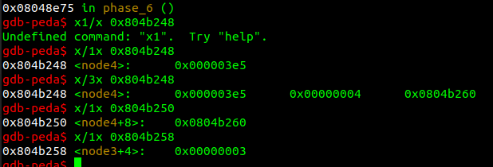

Its a structure called node and has 3 values last one looks like a pointer and this node must be a linked list and [esi+0x8] is the next linked list so it checks if the next linked list is smaller than this

lets check the values in each linked list


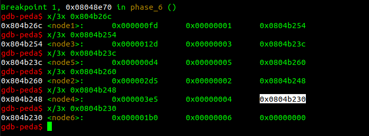

Here the nodes are ordered in the way we give our input. One of the loops that we skipped is ordering these linked lists in the order of our input. 

We have to order it in the decreasing order so that every next list is smaller. That order is 4,2,6,3,1,5

input : **4 2 6 3 1 5**

### secret_phase

It is only called when the second argument in `phase_4` is **austinpowers** 

`disas secret_phase` gives us

```assembly
   0x08048ee8 <+0>:	push   ebp
   0x08048ee9 <+1>:	mov    ebp,esp
   0x08048eeb <+3>:	sub    esp,0x14
   0x08048eee <+6>:	push   ebx
   0x08048eef <+7>:	call   0x80491fc <read_line>
   0x08048ef4 <+12>:	push   0x0
   0x08048ef6 <+14>:	push   0xa
   0x08048ef8 <+16>:	push   0x0
   0x08048efa <+18>:	push   eax
   0x08048efb <+19>:	call   0x80487f0 <__strtol_internal@plt>
   0x08048f00 <+24>:	add    esp,0x10
   0x08048f03 <+27>:	mov    ebx,eax
   0x08048f05 <+29>:	lea    eax,[ebx-0x1]
   0x08048f08 <+32>:	cmp    eax,0x3e8
   0x08048f0d <+37>:	jbe    0x8048f14 <secret_phase+44>
   0x08048f0f <+39>:	call   0x80494fc <explode_bomb>
   0x08048f14 <+44>:	add    esp,0xfffffff8
   0x08048f17 <+47>:	push   ebx
   0x08048f18 <+48>:	push   0x804b320
   0x08048f1d <+53>:	call   0x8048e94 <fun7>
   0x08048f22 <+58>:	add    esp,0x10
   0x08048f25 <+61>:	cmp    eax,0x7
   0x08048f28 <+64>:	je     0x8048f2f <secret_phase+71>
   0x08048f2a <+66>:	call   0x80494fc <explode_bomb>
   0x08048f2f <+71>:	add    esp,0xfffffff4
   0x08048f32 <+74>:	push   0x8049820
   0x08048f37 <+79>:	call   0x8048810 <printf@plt>
   0x08048f3c <+84>:	call   0x804952c <phase_defused>
   0x08048f41 <+89>:	mov    ebx,DWORD PTR [ebp-0x18]
   0x08048f44 <+92>:	mov    esp,ebp
   0x08048f46 <+94>:	pop    ebp
   0x08048f47 <+95>:	ret
```

Here it checks whether our input is greater than 1001. Then it calls another function `fun7`

`disas fun7`

```assembly
   0x08048e94 <+0>:	push   ebp
   0x08048e95 <+1>:	mov    ebp,esp
   0x08048e97 <+3>:	sub    esp,0x8
   0x08048e9a <+6>:	mov    edx,DWORD PTR [ebp+0x8]
   0x08048e9d <+9>:	mov    eax,DWORD PTR [ebp+0xc]
   0x08048ea0 <+12>:	test   edx,edx
   0x08048ea2 <+14>:	jne    0x8048eb0 <fun7+28>
   0x08048ea4 <+16>:	mov    eax,0xffffffff
   0x08048ea9 <+21>:	jmp    0x8048ee2 <fun7+78>
   0x08048eab <+23>:	nop
   0x08048eac <+24>:	lea    esi,[esi+eiz*1+0x0]
   0x08048eb0 <+28>:	cmp    eax,DWORD PTR [edx]
   0x08048eb2 <+30>:	jge    0x8048ec5 <fun7+49>
   0x08048eb4 <+32>:	add    esp,0xfffffff8
   0x08048eb7 <+35>:	push   eax
   0x08048eb8 <+36>:	mov    eax,DWORD PTR [edx+0x4]
   0x08048ebb <+39>:	push   eax
   0x08048ebc <+40>:	call   0x8048e94 <fun7>
   0x08048ec1 <+45>:	add    eax,eax
   0x08048ec3 <+47>:	jmp    0x8048ee2 <fun7+78>
   0x08048ec5 <+49>:	cmp    eax,DWORD PTR [edx]
   0x08048ec7 <+51>:	je     0x8048ee0 <fun7+76>
   0x08048ec9 <+53>:	add    esp,0xfffffff8
   0x08048ecc <+56>:	push   eax
   0x08048ecd <+57>:	mov    eax,DWORD PTR [edx+0x8]
   0x08048ed0 <+60>:	push   eax
   0x08048ed1 <+61>:	call   0x8048e94 <fun7>
   0x08048ed6 <+66>:	add    eax,eax
   0x08048ed8 <+68>:	inc    eax
   0x08048ed9 <+69>:	jmp    0x8048ee2 <fun7+78>
   0x08048edb <+71>:	nop
   0x08048edc <+72>:	lea    esi,[esi+eiz*1+0x0]
   0x08048ee0 <+76>:	xor    eax,eax
   0x08048ee2 <+78>:	mov    esp,ebp
   0x08048ee4 <+80>:	pop    ebp
   0x08048ee5 <+81>:	ret
```

This function is recursive and when we exit this function the value of eax should be 7.

for that this part of code should be executed exactly 3 times

```
0x08048ec9 <+53>:	add    esp,0xfffffff8
   0x08048ecc <+56>:	push   eax
   0x08048ecd <+57>:	mov    eax,DWORD PTR [edx+0x8]
   0x08048ed0 <+60>:	push   eax
   0x08048ed1 <+61>:	call   0x8048e94 <fun7>
   0x08048ed6 <+66>:	add    eax,eax
   0x08048ed8 <+68>:	inc    eax
   0x08048ed9 <+69>:	jmp    0x8048ee2 <fun7+78>
```

This executes only when our input is greater than [edx] and not equal to [edx]. So we want this to be greater than [edx] 3 times and then equal to [edx] the 4th time.

We have to input the value of [edx] in the 4th iteration. When we check the value of [edx] in 4th iteration we get 0x3E9 Which is the highest possible input. We input that and the bomb will be diffused

input : **1001**

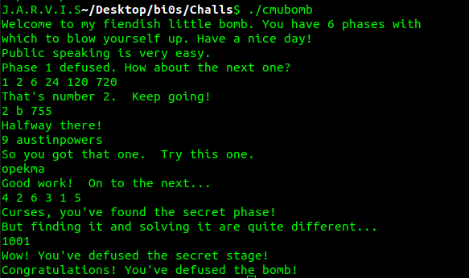

##### inputs

```
Public speaking is very easy.
1 2 6 24 120 720
2 b 755
9 austinpowers
opekma
4 2 6 3 1 5
1001
```

## Crackme

### Crackme0x01

```assembly
   0x080483e4 <+0>:	push   ebp
   0x080483e5 <+1>:	mov    ebp,esp
   0x080483e7 <+3>:	sub    esp,0x18
   0x080483ea <+6>:	and    esp,0xfffffff0
   0x080483ed <+9>:	mov    eax,0x0
   0x080483f2 <+14>:	add    eax,0xf
   0x080483f5 <+17>:	add    eax,0xf
   0x080483f8 <+20>:	shr    eax,0x4
   0x080483fb <+23>:	shl    eax,0x4
   0x080483fe <+26>:	sub    esp,eax
   0x08048400 <+28>:	mov    DWORD PTR [esp],0x8048528
   0x08048407 <+35>:	call   0x804831c <printf@plt>
   0x0804840c <+40>:	mov    DWORD PTR [esp],0x8048541
   0x08048413 <+47>:	call   0x804831c <printf@plt>
   0x08048418 <+52>:	lea    eax,[ebp-0x4]
   0x0804841b <+55>:	mov    DWORD PTR [esp+0x4],eax
   0x0804841f <+59>:	mov    DWORD PTR [esp],0x804854c
   0x08048426 <+66>:	call   0x804830c <scanf@plt>
   0x0804842b <+71>:	cmp    DWORD PTR [ebp-0x4],0x149a
   0x08048432 <+78>:	je     0x8048442 <main+94>
   0x08048434 <+80>:	mov    DWORD PTR [esp],0x804854f
   0x0804843b <+87>:	call   0x804831c <printf@plt>
   0x08048440 <+92>:	jmp    0x804844e <main+106>
   0x08048442 <+94>:	mov    DWORD PTR [esp],0x8048562
   0x08048449 <+101>:	call   0x804831c <printf@plt>
   0x0804844e <+106>:	mov    eax,0x0
   0x08048453 <+111>:	leave  
   0x08048454 <+112>:	ret 
```

When we disassemble the main function we can see that the program is comparing our input with **149A** which is hex for **5274**. So when we input **5274** as password it says Password OK :)

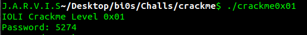

### Crackme0x02

disassembling main gives us

```assembly
   0x080483e4 <+0>:	push   ebp
   0x080483e5 <+1>:	mov    ebp,esp
   0x080483e7 <+3>:	sub    esp,0x18
   0x080483ea <+6>:	and    esp,0xfffffff0
   0x080483ed <+9>:	mov    eax,0x0
   0x080483f2 <+14>:	add    eax,0xf
   0x080483f5 <+17>:	add    eax,0xf
   0x080483f8 <+20>:	shr    eax,0x4
   0x080483fb <+23>:	shl    eax,0x4
   0x080483fe <+26>:	sub    esp,eax
   0x08048400 <+28>:	mov    DWORD PTR [esp],0x8048548
   0x08048407 <+35>:	call   0x804831c <printf@plt>
   0x0804840c <+40>:	mov    DWORD PTR [esp],0x8048561
   0x08048413 <+47>:	call   0x804831c <printf@plt>
   0x08048418 <+52>:	lea    eax,[ebp-0x4]
   0x0804841b <+55>:	mov    DWORD PTR [esp+0x4],eax
   0x0804841f <+59>:	mov    DWORD PTR [esp],0x804856c
   0x08048426 <+66>:	call   0x804830c <scanf@plt>
   0x0804842b <+71>:	mov    DWORD PTR [ebp-0x8],0x5a
   0x08048432 <+78>:	mov    DWORD PTR [ebp-0xc],0x1ec
   0x08048439 <+85>:	mov    edx,DWORD PTR [ebp-0xc]
   0x0804843c <+88>:	lea    eax,[ebp-0x8]
   0x0804843f <+91>:	add    DWORD PTR [eax],edx
   0x08048441 <+93>:	mov    eax,DWORD PTR [ebp-0x8]
   0x08048444 <+96>:	imul   eax,DWORD PTR [ebp-0x8]
   0x08048448 <+100>:	mov    DWORD PTR [ebp-0xc],eax
   0x0804844b <+103>:	mov    eax,DWORD PTR [ebp-0x4]
   0x0804844e <+106>:	cmp    eax,DWORD PTR [ebp-0xc]
   0x08048451 <+109>:	jne    0x8048461 <main+125>
   0x08048453 <+111>:	mov    DWORD PTR [esp],0x804856f
   0x0804845a <+118>:	call   0x804831c <printf@plt>
   0x0804845f <+123>:	jmp    0x804846d <main+137>
   0x08048461 <+125>:	mov    DWORD PTR [esp],0x804857f
   0x08048468 <+132>:	call   0x804831c <printf@plt>
   0x0804846d <+137>:	mov    eax,0x0
   0x08048472 <+142>:	leave  
   0x08048473 <+143>:	ret 
```

Here some calculations are happening and the result is compared with our input. We can either do the calculations ourselves our set a break point before the `cmp` function. 

Setting a break point at `0x08048444`  and  performing `info registers` gave us 

```
eax            0x52b24             0x52b24
```

Here 52b24 is the value our input is checked with. Which is in decimal 338724

So giving the input **338724** gives us Password OK :)

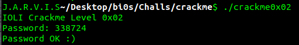

### Crackme0x03

Disassembling main gives us

```assembly
0x08048498 <+0>:	push   ebp
   0x08048499 <+1>:	mov    ebp,esp
   0x0804849b <+3>:	sub    esp,0x18
   0x0804849e <+6>:	and    esp,0xfffffff0
   0x080484a1 <+9>:	mov    eax,0x0
   0x080484a6 <+14>:	add    eax,0xf
   0x080484a9 <+17>:	add    eax,0xf
   0x080484ac <+20>:	shr    eax,0x4
   0x080484af <+23>:	shl    eax,0x4
   0x080484b2 <+26>:	sub    esp,eax
   0x080484b4 <+28>:	mov    DWORD PTR [esp],0x8048610
   0x080484bb <+35>:	call   0x8048350 <printf@plt>
   0x080484c0 <+40>:	mov    DWORD PTR [esp],0x8048629
   0x080484c7 <+47>:	call   0x8048350 <printf@plt>
   0x080484cc <+52>:	lea    eax,[ebp-0x4]
   0x080484cf <+55>:	mov    DWORD PTR [esp+0x4],eax
   0x080484d3 <+59>:	mov    DWORD PTR [esp],0x8048634
   0x080484da <+66>:	call   0x8048330 <scanf@plt>
   0x080484df <+71>:	mov    DWORD PTR [ebp-0x8],0x5a
   0x080484e6 <+78>:	mov    DWORD PTR [ebp-0xc],0x1ec
   0x080484ed <+85>:	mov    edx,DWORD PTR [ebp-0xc]
   0x080484f0 <+88>:	lea    eax,[ebp-0x8]
   0x080484f3 <+91>:	add    DWORD PTR [eax],edx
   0x080484f5 <+93>:	mov    eax,DWORD PTR [ebp-0x8]
   0x080484f8 <+96>:	imul   eax,DWORD PTR [ebp-0x8]
   0x080484fc <+100>:	mov    DWORD PTR [ebp-0xc],eax
   0x080484ff <+103>:	mov    eax,DWORD PTR [ebp-0xc]
   0x08048502 <+106>:	mov    DWORD PTR [esp+0x4],eax
   0x08048506 <+110>:	mov    eax,DWORD PTR [ebp-0x4]
   0x08048509 <+113>:	mov    DWORD PTR [esp],eax
   0x0804850c <+116>:	call   0x804846e <test>
   0x08048511 <+121>:	mov    eax,0x0
   0x08048516 <+126>:	leave  
   0x08048517 <+127>:	ret
```

Dissassembling test give us

```assembly
   0x0804846e <+0>:	push   ebp
   0x0804846f <+1>:	mov    ebp,esp
   0x08048471 <+3>:	sub    esp,0x8
   0x08048474 <+6>:	mov    eax,DWORD PTR [ebp+0x8]
   0x08048477 <+9>:	cmp    eax,DWORD PTR [ebp+0xc]
   0x0804847a <+12>:	je     0x804848a <test+28>
   0x0804847c <+14>:	mov    DWORD PTR [esp],0x80485ec
   0x08048483 <+21>:	call   0x8048414 <shift>
   0x08048488 <+26>:	jmp    0x8048496 <test+40>
   0x0804848a <+28>:	mov    DWORD PTR [esp],0x80485fe
   0x08048491 <+35>:	call   0x8048414 <shift>
   0x08048496 <+40>:	leave  
   0x08048497 <+41>:	ret   
```

Here the calculations are the same as 2nd one but the comparing happens on another function. So giving the input **338724** gives us Password OK!!! :)

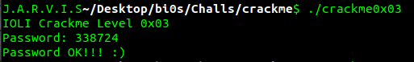

### Crackme0x04

Here our input is string and is checked with a function check. `disas check` gives

```assembly
   0x08048484 <+0>:	push   ebp
   0x08048485 <+1>:	mov    ebp,esp
   0x08048487 <+3>:	sub    esp,0x28
   0x0804848a <+6>:	mov    DWORD PTR [ebp-0x8],0x0
   0x08048491 <+13>:	mov    DWORD PTR [ebp-0xc],0x0
   0x08048498 <+20>:	mov    eax,DWORD PTR [ebp+0x8]
   0x0804849b <+23>:	mov    DWORD PTR [esp],eax
   0x0804849e <+26>:	call   0x8048384 <strlen@plt>
   0x080484a3 <+31>:	cmp    DWORD PTR [ebp-0xc],eax
   0x080484a6 <+34>:	jae    0x80484fb <check+119>
   0x080484a8 <+36>:	mov    eax,DWORD PTR [ebp-0xc]
   0x080484ab <+39>:	add    eax,DWORD PTR [ebp+0x8]
   0x080484ae <+42>:	movzx  eax,BYTE PTR [eax]
   0x080484b1 <+45>:	mov    BYTE PTR [ebp-0xd],al
   0x080484b4 <+48>:	lea    eax,[ebp-0x4]
   0x080484b7 <+51>:	mov    DWORD PTR [esp+0x8],eax
   0x080484bb <+55>:	mov    DWORD PTR [esp+0x4],0x8048638
   0x080484c3 <+63>:	lea    eax,[ebp-0xd]
   0x080484c6 <+66>:	mov    DWORD PTR [esp],eax
   0x080484c9 <+69>:	call   0x80483a4 <sscanf@plt>
   0x080484ce <+74>:	mov    edx,DWORD PTR [ebp-0x4]
   0x080484d1 <+77>:	lea    eax,[ebp-0x8]
   0x080484d4 <+80>:	add    DWORD PTR [eax],edx
   0x080484d6 <+82>:	cmp    DWORD PTR [ebp-0x8],0xf
   0x080484da <+86>:	jne    0x80484f4 <check+112>
   0x080484dc <+88>:	mov    DWORD PTR [esp],0x804863b
   0x080484e3 <+95>:	call   0x8048394 <printf@plt>
   0x080484e8 <+100>:	mov    DWORD PTR [esp],0x0
   0x080484ef <+107>:	call   0x80483b4 <exit@plt>
   0x080484f4 <+112>:	lea    eax,[ebp-0xc]
   0x080484f7 <+115>:	inc    DWORD PTR [eax]
   0x080484f9 <+117>:	jmp    0x8048498 <check+20>
   0x080484fb <+119>:	mov    DWORD PTR [esp],0x8048649
   0x08048502 <+126>:	call   0x8048394 <printf@plt>
   0x08048507 <+131>:	leave  
   0x08048508 <+132>:	ret
```

Here the input is taken as a string and later on each character is taken as a number and the numbers are added on each iteration and checks whether the sum is 0xF (15) or not. So we have to input a number whose sum of digits is 15

**12345** will give Password OK!

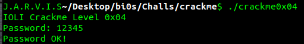

### Crackme0x05

This is similar to the one before and here also the `check` function is similar. Here instead of checking for 0xF it checks for 0x10 (16) and if the sum is 16 it will call another function parell. `disas parell` gives us

```assembly
   0x08048484 <+0>:	push   ebp
   0x08048485 <+1>:	mov    ebp,esp
   0x08048487 <+3>:	sub    esp,0x18
   0x0804848a <+6>:	lea    eax,[ebp-0x4]
   0x0804848d <+9>:	mov    DWORD PTR [esp+0x8],eax
   0x08048491 <+13>:	mov    DWORD PTR [esp+0x4],0x8048668
   0x08048499 <+21>:	mov    eax,DWORD PTR [ebp+0x8]
   0x0804849c <+24>:	mov    DWORD PTR [esp],eax
   0x0804849f <+27>:	call   0x80483a4 <sscanf@plt>
   0x080484a4 <+32>:	mov    eax,DWORD PTR [ebp-0x4]
   0x080484a7 <+35>:	and    eax,0x1
   0x080484aa <+38>:	test   eax,eax
   0x080484ac <+40>:	jne    0x80484c6 <parell+66>
   0x080484ae <+42>:	mov    DWORD PTR [esp],0x804866b
   0x080484b5 <+49>:	call   0x8048394 <printf@plt>
   0x080484ba <+54>:	mov    DWORD PTR [esp],0x0
   0x080484c1 <+61>:	call   0x80483b4 <exit@plt>
   0x080484c6 <+66>:	leave  
   0x080484c7 <+67>:	ret 
```

Here in the `parell` function it is checking if the LSB of the number we input is 0.

```assembly
0x080484a7 <+35>:	and    eax,0x1
0x080484aa <+38>:	test   eax,eax
0x080484ac <+40>:	jne    0x80484c6 <parell+66>
```

Here eax will have the LSB of our input. So we have to input a number with sum of digits 16 and LSB 0

input **88** will give Password OK!

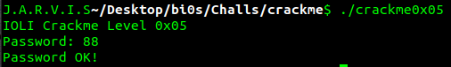

### Crackme0x06

This is similar to the one before and here also the `check` function is similar. Here it checks for 0x10 (16) and in the function parell it calls another function dummy. `disas dummy` gives us

```assembly
   0x080484b4 <+0>:	push   ebp
   0x080484b5 <+1>:	mov    ebp,esp
   0x080484b7 <+3>:	sub    esp,0x18
   0x080484ba <+6>:	mov    DWORD PTR [ebp-0x4],0x0
   0x080484c1 <+13>:	mov    eax,DWORD PTR [ebp-0x4]
   0x080484c4 <+16>:	lea    edx,[eax*4+0x0]
   0x080484cb <+23>:	mov    eax,DWORD PTR [ebp+0xc]
   0x080484ce <+26>:	cmp    DWORD PTR [edx+eax*1],0x0
   0x080484d2 <+30>:	je     0x804850e <dummy+90>
   0x080484d4 <+32>:	mov    eax,DWORD PTR [ebp-0x4]
   0x080484d7 <+35>:	lea    ecx,[eax*4+0x0]
   0x080484de <+42>:	mov    edx,DWORD PTR [ebp+0xc]
   0x080484e1 <+45>:	lea    eax,[ebp-0x4]
   0x080484e4 <+48>:	inc    DWORD PTR [eax]
   0x080484e6 <+50>:	mov    DWORD PTR [esp+0x8],0x3
   0x080484ee <+58>:	mov    DWORD PTR [esp+0x4],0x8048738
   0x080484f6 <+66>:	mov    eax,DWORD PTR [ecx+edx*1]
   0x080484f9 <+69>:	mov    DWORD PTR [esp],eax
   0x080484fc <+72>:	call   0x80483d8 <strncmp@plt>
   0x08048501 <+77>:	test   eax,eax
   0x08048503 <+79>:	jne    0x80484c1 <dummy+13>
   0x08048505 <+81>:	mov    DWORD PTR [ebp-0x8],0x1
   0x0804850c <+88>:	jmp    0x8048515 <dummy+97>
   0x0804850e <+90>:	mov    DWORD PTR [ebp-0x8],0x0
   0x08048515 <+97>:	mov    eax,DWORD PTR [ebp-0x8]
   0x08048518 <+100>:	leave  
   0x08048519 <+101>:	ret  
```

Here it iterates through all environment variables and compares first 3 letters of the environment variable to LOL. So we have to export an environment variable with name LOL and input **88**

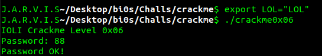

### crackme0x07

It's similar to the earlier one and the password **88** with environment variable LOL was accepted. But we couldn't disassemble it in gdb as it said no symbol table was loaded (so I solved it using IDA first)

I took `info file` and found the address of .text section and disassembled that using the addresses

The functions `dummy`, `parell` were the same, but the function `check` had some more things. It is only accessed on a wrong input and function `dummy` is called here also. So we can just export an environment variable with name LOL and input **88** to get **Password OK!**

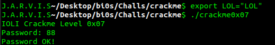

### crackme0x08

This is similar to crackme0x07 but can be disassembled in gdb. There is an extra function `che` which is called inside the `check` function. This just prints Password Incorrect! and exits. So code after it is not accessible. 

We can just export an environment variable with name LOL and input **88** here too to get **Password OK!**

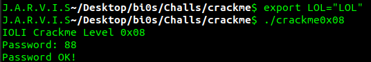

### crackme0x09

This is similar to crackme0x07 and it also says no symbol table is loaded.(so I solved it using IDA again)

I took `info file` again and found the address of .text section and disassembled that using the addresses

Here also `dummy`, `parell` were the same, but the function `check` had an extra function `che` which just prints  Password Incorrect! and exits.

Here too we can just export an environment variable with name LOL and input **88** to get **Password OK!**

### 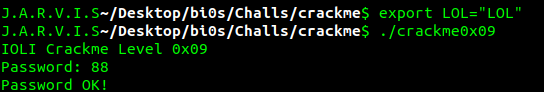

### crackme0x00a

`disas main` gives us :

```assembly
   0x080484e4 <+0>:	push   ebp
   0x080484e5 <+1>:	mov    ebp,esp
   0x080484e7 <+3>:	and    esp,0xfffffff0
   0x080484ea <+6>:	sub    esp,0x30
   0x080484ed <+9>:	mov    eax,gs:0x14
   0x080484f3 <+15>:	mov    DWORD PTR [esp+0x2c],eax
   0x080484f7 <+19>:	xor    eax,eax
   0x080484f9 <+21>:	mov    eax,0x8048640
   0x080484fe <+26>:	mov    DWORD PTR [esp],eax
   0x08048501 <+29>:	call   0x80483d0 <printf@plt>
   0x08048506 <+34>:	mov    eax,0x8048651
   0x0804850b <+39>:	lea    edx,[esp+0x13]
   0x0804850f <+43>:	mov    DWORD PTR [esp+0x4],edx
   0x08048513 <+47>:	mov    DWORD PTR [esp],eax
   0x08048516 <+50>:	call   0x8048420 <__isoc99_scanf@plt>
   0x0804851b <+55>:	lea    eax,[esp+0x13]
   0x0804851f <+59>:	mov    DWORD PTR [esp+0x4],eax
   0x08048523 <+63>:	mov    DWORD PTR [esp],0x804a024
   0x0804852a <+70>:	call   0x80483c0 <strcmp@plt>
   0x0804852f <+75>:	test   eax,eax
   0x08048531 <+77>:	jne    0x8048554 <main+112>
   0x08048533 <+79>:	mov    DWORD PTR [esp],0x8048654
   0x0804853a <+86>:	call   0x80483f0 <puts@plt>
   0x0804853f <+91>:	nop
   0x08048540 <+92>:	mov    eax,0x0
   0x08048545 <+97>:	mov    edx,DWORD PTR [esp+0x2c]
   0x08048549 <+101>:	xor    edx,DWORD PTR gs:0x14
   0x08048550 <+108>:	je     0x8048567 <main+131>
   0x08048552 <+110>:	jmp    0x8048562 <main+126>
   0x08048554 <+112>:	mov    DWORD PTR [esp],0x804865e
   0x0804855b <+119>:	call   0x80483f0 <puts@plt>
   0x08048560 <+124>:	jmp    0x80484f9 <main+21>
   0x08048562 <+126>:	call   0x80483e0 <__stack_chk_fail@plt>
   0x08048567 <+131>:	leave  
   0x08048568 <+132>:	ret
```

Here our input is compared with "g00dJ0B!" so we have to input that 

input : **g00dJ0B!**

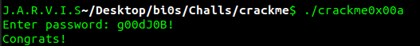

### crackme0x00b

`disas main` gives us :

```assembly
 0x08048494 <+0>:	push   ebp
   0x08048495 <+1>:	mov    ebp,esp
   0x08048497 <+3>:	and    esp,0xfffffff0
   0x0804849a <+6>:	add    esp,0xffffff80
   0x0804849d <+9>:	mov    eax,0x80485d0
   0x080484a2 <+14>:	mov    DWORD PTR [esp],eax
   0x080484a5 <+17>:	call   0x8048380 <printf@plt>
   0x080484aa <+22>:	mov    eax,0x80485e1
   0x080484af <+27>:	lea    edx,[esp+0x1c]
   0x080484b3 <+31>:	mov    DWORD PTR [esp+0x4],edx
   0x080484b7 <+35>:	mov    DWORD PTR [esp],eax
   0x080484ba <+38>:	call   0x80483d0 <__isoc99_scanf@plt>
   0x080484bf <+43>:	lea    eax,[esp+0x1c]
   0x080484c3 <+47>:	mov    DWORD PTR [esp+0x4],eax
   0x080484c7 <+51>:	mov    DWORD PTR [esp],0x804a040
   0x080484ce <+58>:	call   0x8048390 <wcscmp@plt>
   0x080484d3 <+63>:	test   eax,eax
   0x080484d5 <+65>:	jne    0x80484eb <main+87>
   0x080484d7 <+67>:	mov    DWORD PTR [esp],0x80485e5
   0x080484de <+74>:	call   0x80483a0 <puts@plt>
   0x080484e3 <+79>:	nop
   0x080484e4 <+80>:	mov    eax,0x0
   0x080484e9 <+85>:	leave  
   0x080484ea <+86>:	ret    
   0x080484eb <+87>:	mov    DWORD PTR [esp],0x80485ef
   0x080484f2 <+94>:	call   0x80483a0 <puts@plt>
   0x080484f7 <+99>:	jmp    0x804849d <main+9>
```

Here our input is compared with wide string at `0x804a040` so we look at what's there

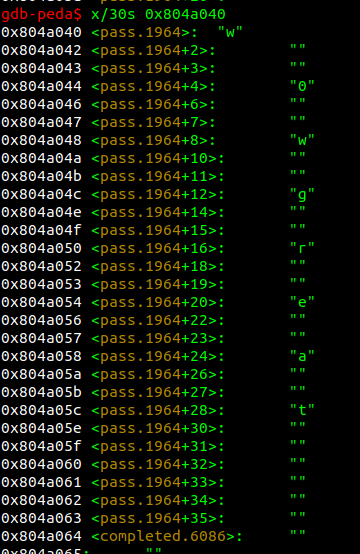 

So we can input w0wgreat

input : **w0wgreat**

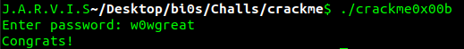